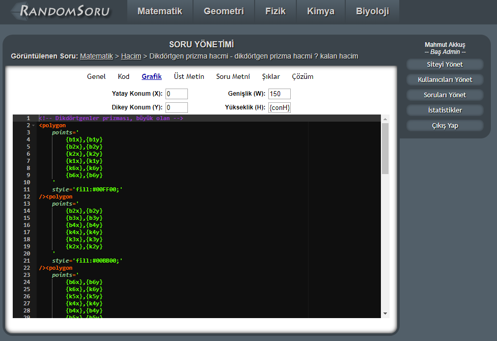
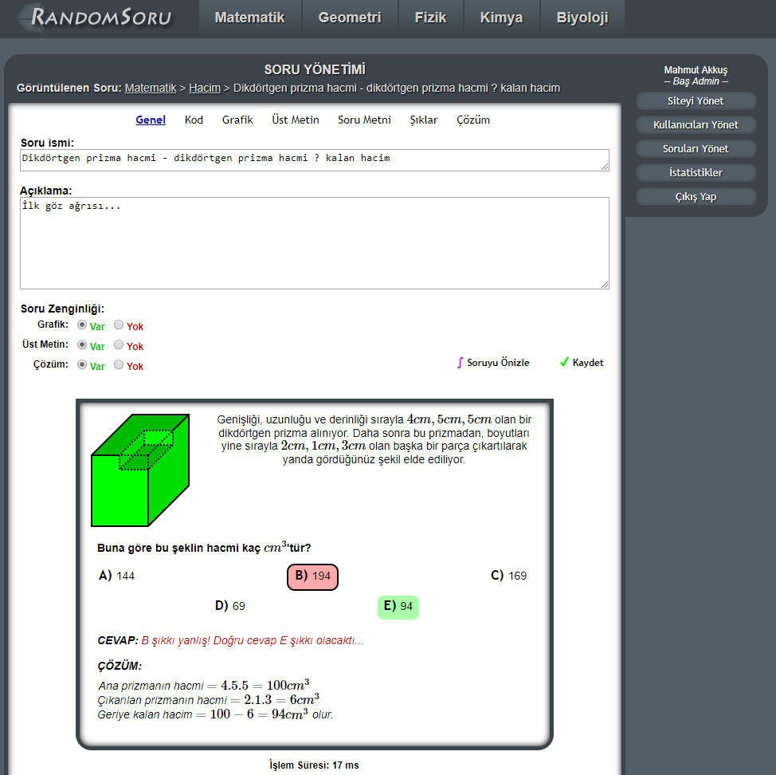
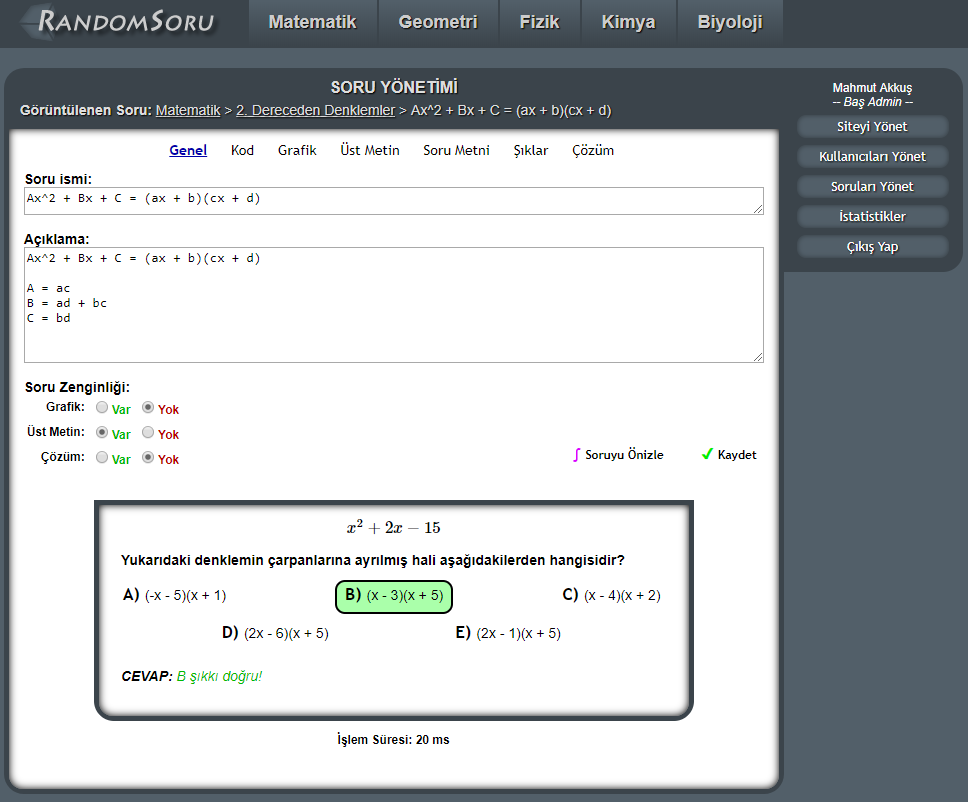
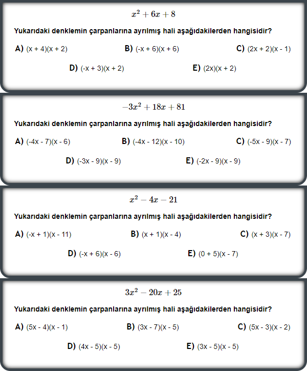

# RandomSoru

RandomSoru is a random educational question generation engine. It generates random questions from questions templates.

I made it back in 2013 when I got bored of studying for university exams, solving questions, which were redundantly
mostly same as each other with different parameters.

I thought, these questions can be generalised and expressed with a template, and their variations then can be generated
 by a computer using random variables. I got very excited and started working on this project instead of studying for university exams.
 
## How does it work?

This a website that users can solve random questions from the topics available in the site. When user selects a topic,
they get a random question of that topic generated for them from question templates, and then displayed to them.

Question templates can be added from the admin panel, by the admin.

To make a question template, first, you define some random variables using PHP:

Then, you write the details (graphics, question texts, answers etc.) of the question using SVG, HTML and LaTeX.
You can use the PHP variables here by writing the variable name in brackets, like this: {var}

When generating the question, system will replace {var} with the corresponding value of the variable.
Here is an example of a generated question:

Here is a generated question from another topic:

And more and more generated variants of the same question template:
