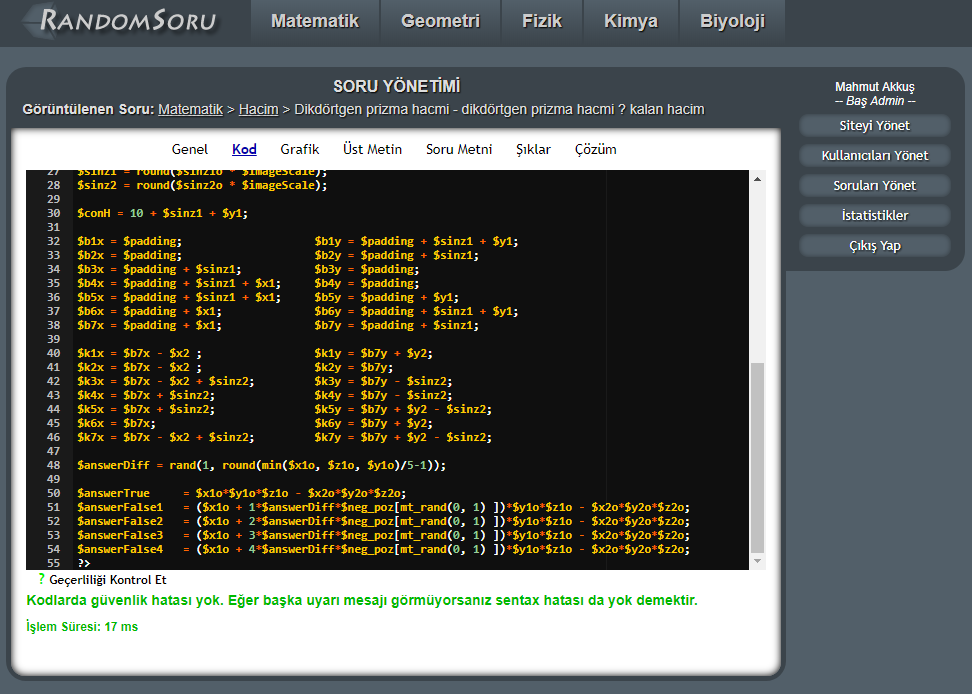

# RandomSoru

RandomSoru is a random educational question generation engine. It generates random questions from questions templates.

I made it back in 2013 when I got bored of studying for university exams, solving questions, which were redundantly
mostly same as each other with different parameters.

I thought, these questions can be generalised and expressed with a template, and their variations then can be generated
 by a computer using random variables. I got very excited and started working on this project instead of studying for university exams.
 
## How does it work?

This a website that users can solve random questions from the topics available in the site. When user selects a topic,
they get a random question of that topic generated for them from question templates, and then displayed to them.

Question templates can be added from the admin panel, by the admin.

To make a question template, first you generate some random variables using PHP:

asd

